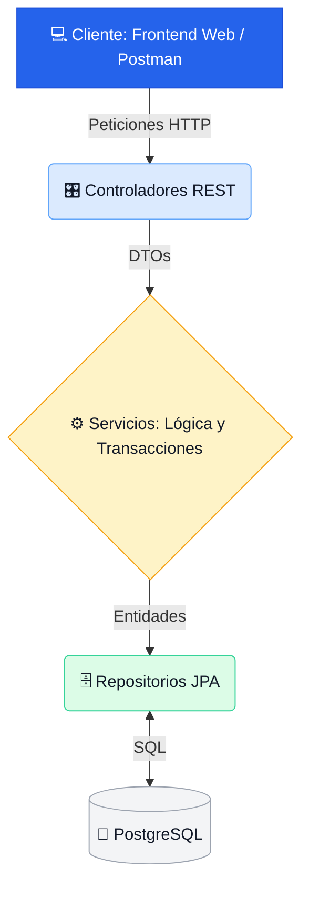

# ⚡ ThunderMax - API de Ferretería en Spring Boot

Sistema backend para la gestión integral de una ferretería guatemalteca, desarrollado con Java 21, Spring Boot 3 y PostgreSQL.

## 🚀 Características Principales

* **Ventas e Inventario:** Control estricto de existencias mediante Kárdex.
* **Cotizaciones:** Generación de proformas y conversión directa a facturas de venta.
* **Herramientas Útiles:** Calculadora de pintura y cemento según el área en m².
* **Reportes:** Top de productos, ventas diarias y valuación del inventario en Quetzales.
* **Documentación Automática:** API completamente documentada con Swagger UI.

## 💻 Tecnologías Utilizadas

* **Lenguaje:** Java 21
* **Framework:** Spring Boot 3 (Web, Data JPA, Validation)
* **Base de Datos:** PostgreSQL 17 (vía Docker)
* **Documentación API:** OpenAPI (Swagger)
* **Gestor de Dependencias:** Maven
* **Librerías de apoyo:** Lombok

## 🛠️ Instalación y Ejecución

1. **Clonar el repositorio:**
   ```bash
   git clone https://github.com/MayroGamerosXZ/-Tarea-04--Java-Spring-Boot.git
   cd -Tarea-04--Java-Spring-Boot
   ```

2. **Levantar PostgreSQL:**
   Asegúrate de tener Docker instalado y ejecuta:
   ```bash
   docker compose up -d
   ```
   *Nota: La base de datos se levanta en el puerto 5433 para evitar conflictos.*

3. **Ejecutar la API:**
   ```bash
   ./mvnw spring-boot:run
   ```

4. **Probar la API:**
   Abre tu navegador en `http://localhost:8080/swagger-ui.html`. 
   La base de datos se inicializa automáticamente con datos de ejemplo (martillos, cemento, pintura, proveedores y clientes).

## 📄 Estructura del Proyecto

* `docs/`: Colección de Postman y manuales.
* `model/`: Entidades JPA (Base de datos).
* `dto/`: Objetos de transferencia de datos (Request/Response).
* `repository/`: Consultas a la base de datos (Spring Data JPA).
* `service/`: Lógica de negocio, cálculos e integraciones.
* `controller/`: Endpoints de la API REST.
* `exception/`: Manejador global de errores (Respuestas 400, 404).

## 📝 Autor
* **Mayro Gameros**


## 🏗️ Arquitectura del Sistema (N-Capas)

El proyecto sigue una arquitectura estricta de N-Capas, garantizando el principio de responsabilidad única.


